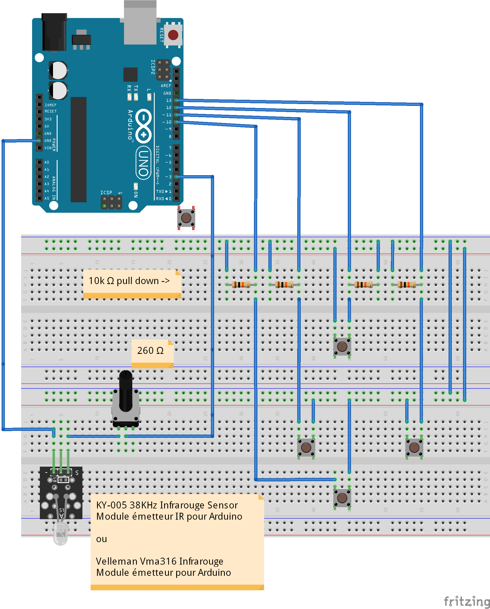

# Une télécommande pour Thymio II avec Arduino
## Le contexte
La télécommande de Thymio est basée sur le système expérimental 
"01_Emetteur_expérimental_avec_Arduino".

Si tu as des questions détaillées concernant la communication infrarouge, 
tu les trouveras dans la section "01_Emetteur_expérimental_avec_Arduino". 

Cela dit, les connaissances en matière de communication infrarouge ne sont pas nécessaires pour 
construire cette télécommande. 
Tu trouveras tout ce dont tu as besoin ici et tu peux la construire en suivant le tutoriel ci-dessous. 

## Du côté hardware
### Avec Arduino UNO R3

### Du côté software
#### Prérequis
1. Activation de la bibliothèque "IRremote"

#### le Robot Thymio II en mode "obéissant" (violet).
Thymio est livré avec six comportements prédéfinis. L'un d'entre eux est "obéissant" (violet). 
Dans ce mode, Thymio peut être contrôlé à distance. 
Pour ce test, il faut connaître les codes à envoyer et le comportement correspondant 
du robot Thymio. 

Codes -> action correspondante de Thymio en mode "obéissant" (violet)
* 2 -> aller en avant 
* 8 -> reculer 
* 4 -> tournez à gauche 
* 6 -> tournez à droite 
* 5 -> Arrêt 

Voici le boucle en C:

    #include <IRremote.h>
    //...et initialisation de cette librairie

     IRsend irsend;
     // Arduino UNO:  sortie = D3

    int pinBouton01;
    int pinBouton02;
    int pinBouton03;
    int pinBouton04;
    void setup()
    {
        Serial.begin(9600);
        pinBouton01=10;
        pinMode(pinBouton01,INPUT);
        pinBouton02=11;
        pinMode(pinBouton02,INPUT);
        pinBouton03=12;
        pinMode(pinBouton03,INPUT);
        pinBouton04=13;
        pinMode(pinBouton04,INPUT);
    }

    void loop() {

      while(1 == 1) {
          boolean etatBouton=digitalRead(pinBouton01);
          boolean etatBouton=digitalRead(pinBouton02);
          boolean etatBouton=digitalRead(pinBouton03);
          boolean etatBouton=digitalRead(pinBouton04);
      
          if (etatBouton== 1) {
              for (int i = 0; i < 3; i++) {
              irsend.sendRC5(2, 12); // Signal à envoyer
              delay(50);
              }
        }
        else {
              for (int i = 0; i < 3; i++) {
              irsend.sendRC5(5, 12); // Signal à envoyer
              delay(50);
              }
        }

        }
        }
         for (int i = 0; i < 3; i++) {
             irsend.sendRC5(ThymioRC5Commands[x], 12); // Signal à envoyer 
             delay(50);
         } 
      delay(4000); //Pause de 4 secondes entre les impulsions de transmission.
      }    

Le résultat est visible dans la vidéo ci-dessous. 
 [Code_RC5.mp4](./Code_RC5.mp4)

