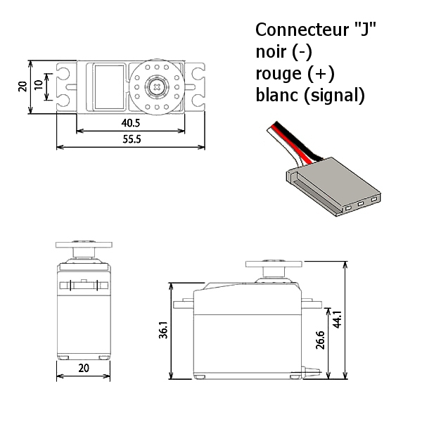

# Pilote de servomoteur à rotation Futaba S3003
## Du côté hardware
### Données techniques du servomoteur: 
* Tension de fonctionnement 4,8 à 6,0VDC
* Courant de drain 7,2 à 8mA
* Vitesse anglaire max 0,19s/60° à vide
* Course angulaire ~120°
* Couple de décrochage :
    * 32 Ncm (3,17 kg/cm) à 4.8 V
    * 41 Ncm (4,10 kg/cm) à 6.0 V
* Dimensions produit:
    * Longueur: 41mm
    * Largeur: 20mm 
    * Hauteur: 36mm
* Poids 37,2g

### Avec Arduino UNO R3

### Du côté software
#### Prérequis
1. Activation de la bibliothèque "IRremote"
2. Testez l'environnement en utilisant l'exemple IRsendDemo.ino fournis avec la bibliothèque. 

#### Code pour comportement Thymio "obéissant" (violet).
Thymio est préprogrammé avec six comportements, dont un comportement "obéissant" (violet). 
Dans ce mode, Thymio attend des commandes de la télécommande. Il est donc idéal pour tester le système expérimental.

> Voici le code complète du comportement "obéissant" de Thymio pour nos lecteurs avancés qui sont familiarisés avec le langage ASEBA: [obeissantV6.aesl](./Code_RC5/obeissantV6.aesl).

Pour ce test, il suffit de connaître les codes RC5 à envoyer et le comportement correspondant du robot Thymio. 

Codes RC5 -> action correspondante de Thymio en mode "obéissant" (violet)
* 2 -> aller en avant 
* 8 -> reculer 
* 4 -> tournez à gauche 
* 6 -> tournez à droite 
* 5 -> Arrêt 

Le [Code_RC5.ino](./Code_RC5/Code_RC5.ino) est un programme simple qui va exécuter la suite des opérations ci-dessous.  

1.    ThymioRC5Commands[0] = 5; -> Thymio en arrêt 
2.    ThymioRC5Commands[1] = 2; -> Aller en avant
3.    ThymioRC5Commands[2] = 5; -> Thymio en arrêt
4.    ThymioRC5Commands[3] = 4; -> Tournez à gauche 
5.    ThymioRC5Commands[4] = 5; -> Thymio en arrêt
6.    ThymioRC5Commands[5] = 6; -> Tournez à droite 
7.    ThymioRC5Commands[6] = 5; -> Thymio en arrêt
8.    ThymioRC5Commands[7] = 8; -> Reculer 
9.    ThymioRC5Commands[8] = 5; -> Thymio en arrêt
10.    ThymioRC5Commands[9] = 5;-> Thymio en arrêt

Chaque action enverra une commande au robot Thymio qui exécutera la séquence de mouvements. Il y a un délai de 4s entre chaque opération. 

Voici le boucle en C:

      for (int x = 0; x < 10; x++) {
         for (int i = 0; i < 3; i++) {
             irsend.sendRC5(ThymioRC5Commands[x], 12); // Signal à envoyer 
             delay(50);
         } 
      delay(4000); //Pause de 4 secondes entre les impulsions de transmission.
      }    

Le résultat est visible dans la vidéo ci-dessous. 
 [Code_RC5.mp4](./Code_RC5.mp4)

***
_Bien que nous ayons réalisé cette expérience en utilisant le protoccol RC5 et le robot Thymio comme cible, il est possible d'utiliser cette configuration pour d'autres protocoles et périphériques (NEC, LG TV, Sony, ....)._

