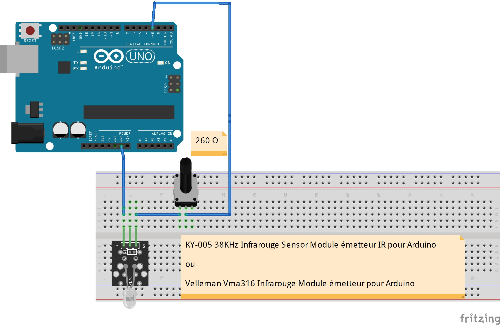

# Emetteur expérimental avec Arduino 
## Le protocole RC5 en bref 
Le protocole de transmission infrarouge RC5, mis au point par Philips, est devenu une norme pour les transmissions de commandes en infrarouge.  
Il est possible de commander le robot Thymio II avec une télécommande qui utilise le RC5 (voir  [La télécommande Thymio](http://wiki.thymio.org/fr:thymioirremote)).
  
Une trame en code RC5 se compose d'une suite de 14 bits et sa construction est la suivante:

* _2 bits de départ (Les 2 bits de départ sont liés à l'ajustement entre le circuit émetteur et le circuit récepteur et ne sont pas accessibles via l'interface de programmation)_
* **1 bit de basculement** 
    * le bit de basculement indique une nouvelle transmission de données
    * Sa valeur change à chaque nouvelle activation d'une touche afin de distinguer une nouvelle pression d'une pression continue sur la même touche.
* **5 bits d'adressage du système** (nous avons donc 32 groupes d'adressage)
    * Ces 5 bits déterminent l'adresse du dispositif devant réagir à la commande. 
    * Nous pouvons par conséquent attribuer une adresse rc5 individuelle à chaque équipement (e.g. Robot) , sans se soucier des influences de réglage d'un appareil sur l'autre.
    * Thymio rc5.address
* **6 bits d'instruction** (Ce qui donne 64 instructions)
    * L'instruction destinée à l'appareil est codée dans les 6 derniers bits.
    * Thymio rc5.command

## Du côté hardware
### Avec Arduino UNO R3

### Du côté software
#### Prérequis
1. Activation de la bibliothèque "IRremote"
2. Testez l'environnement en utilisant l'exemple IRsendDemo.ino fournis avec la bibliothèque. 

#### Code pour comportement Thymio "obéissant" (violet).
Thymio est préprogrammé avec six comportements, dont un comportement "obéissant" (violet). 
Dans ce mode, Thymio attend des commandes de la télécommande. Il est donc idéal pour tester le système expérimental.
Pour une description complète du code, cliquez ici: [obeissantV6.aesl](./Code_RC5/obeissantV6.aesl).

Codes RC5 et actions de robot correspondantes
* 2 -> aller en avant 
* 8 -> reculer 
* 4 -> tournez à gauche 
* 6 -> tournez à droite 
* 5 -> Arrêt 

Le [Code_RC5.ino](./Code_RC5/Code_RC5.ino) est un programme simple qui va exécuter la suite des opérations ci-dessous. 
1.    ThymioRC5Commands[0] = 5;     // 5 -> Arrêt
2.    ThymioRC5Commands[1] = 2;     // 2 -> Aller en avant
3.    ThymioRC5Commands[2] = 5;     // 5 -> Arrêt 
4.    ThymioRC5Commands[3] = 4;     // 4 -> Tournez à gauche 
5.    ThymioRC5Commands[4] = 5;     // 5 -> Arrêt
6.    ThymioRC5Commands[5] = 6;     // 6 -> Tournez à droite 
7.    ThymioRC5Commands[6] = 5;     // 5 -> Arrêt
8.    ThymioRC5Commands[7] = 8;     // 8 -> Reculer 
9.    ThymioRC5Commands[8] = 5;     // 5 -> Arrêt
10.    ThymioRC5Commands[9] = 5;    // 5 -> Arrêt

Chaque action enverra une commande au robot Thymio qui exécutera la séquence de mouvements. Le résultat est visible dans la vidéo ci-dessous. 
 [Code_RC5.mp4](./Code_RC5.mp4)

***
_Bien que nous ayons réalisé cette expérience en utilisant le protoccol RC5 et le robot Thymio comme cible, il est possible d'utiliser cette configuration pour d'autres protocoles et périphériques (NEC, LG TV, Sony, ....)._

